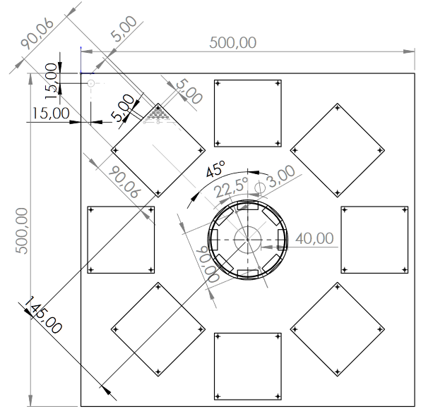

# Introduction

This KiCAD project is part of the Astronautix FlatSat project, which aims to create an extensible platform for nanosatellite subsystem prototyping and experimentation.

   

The FlatSat platform is composed of a main metallic support plate, which can possibly host 8 submodules in star configuration. Each submodule is composed of a STM32F429IDISCOVERY board and a custom adapter hat.

All modules are hooked to a central hub  (**this project**) via a sub-d DB26HD harness. The central hub has the main purpose of routing UART signals, regulating power (dispatched via sub-d, switchable) and linking all submodules together.

# The IonSat FlatSat Hub

This is the repository to host the Flatsat central hub. 

The most important task of the FlatSat hub, aside of routing the module's signals together, is being able of handling and dispatching power. 
    
Compared to the modules, this results in a slightly more complex card layout, albeit prettier. 
The multi-level schematic also gets more intricate.